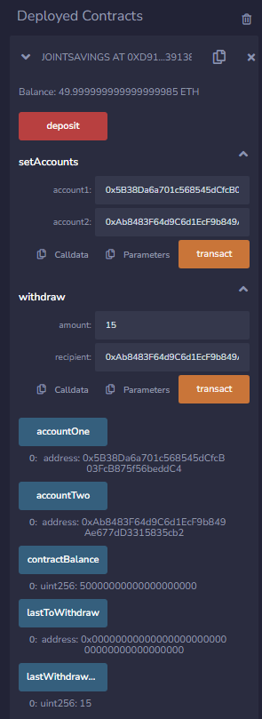
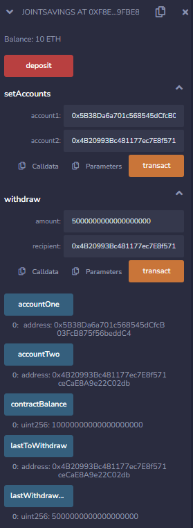
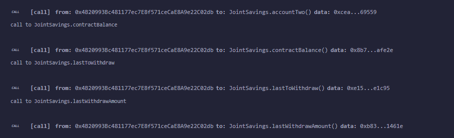

# Smart-Contracts
---
####  The JointSavings smart contract is a Solidity program designed to facilitate joint savings between two accounts on the Ethereum blockchain. The contract allows two designated addresses (accountOne and accountTwo) to contribute funds to a shared savings pool and withdraw funds when needed.
---
*The JointSavings smart contract is a secure and transparent solution for joint savings between two parties on the Ethereum blockchain. It offers the following benefits:*

1. Trustless Management: The contract's rules are encoded in the Ethereum blockchain, ensuring that funds can only be accessed by the designated accounts. This eliminates the need for a third-party intermediary and promotes trust between the participants.

2. Security and Immutability: Once deployed on the blockchain, the contract's code cannot be altered or tampered with, ensuring the safety and integrity of the savings pool.

3. Flexibility: The contract allows for seamless deposits and withdrawals, providing both parties with easy access to their shared funds whenever needed.

4. Transparency: All transactions and operations on the contract are publicly visible on the blockchain, providing transparency and accountability for all participants.

